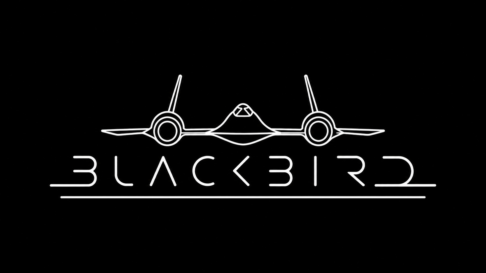

  

# BlackBird Launcher — Releases & Distribution
### *Canal oficial de distribución de versiones compiladas (APK) y actualizaciones OTA para autorradios Android*

  

  
  
  
  

---

## 📥 Descarga e Instalación

### Método 1: Actualización Automática OTA (Recomendado)
Si ya tienes instalada una versión de **BlackBird Launcher**:
1. Conecta la autorradio a una red Wi-Fi o datos móviles.
2. Abre **Ajustes ➔ Sistema ➔ Actualización de Software**.
3. Pulsa **COMPROBAR**: la aplicación detectará automáticamente la nueva versión y te permitirá descargarla e instalarla en pantalla sin necesidad de memorias USB.

### Método 2: Instalación Manual por APK
1. Descarga el paquete `.apk` de la versión más reciente desde la sección [Releases](../../releases/latest).
2. Copia el archivo a una memoria USB o descárgalo directamente desde el navegador de la autorradio.
3. Abre el explorador de archivos de la radio, pulsa sobre el APK e instala la aplicación.
4. Pulsa el botón **HOME** de la pantalla o del volante y selecciona **BlackBird** como aplicación de inicio predeterminada (*«Siempre»*).

---

## 🚗 Matriz de Compatibilidad

| Componente / Subsistema | Nivel de Compatibilidad | Notas Técnicas |
| :--- | :---: | :--- |
| **Android Base** | **Nativo** | Compatible con Android 9.0 (API 28) hasta Android 12.0. |
| **Chipset Objetivo** | **Nativo** | Optimizado específicamente para procesadores MediaTek AC8257 / Autochips / Jancar. |
| **Radio FM/AM Física** | **Soportado** | Control directo del chip sintonizador de la placa base vía IPC. |
| **Bluetooth OEM** | **Soportado** | Manos libres y streaming mediante el servicio de audio del fabricante. |
| **Bus CAN Nativo** | **Soportado** | Lectura pasiva de telemetría, marcha atrás e iluminación. |
| **Posicionamiento GNSS** | **Nativo** | Velocímetro por satélite con interpolación inercial continua. |

---

## 📋 Registro de Versiones (Changelog Reciente)

### [v3.7.4 (Release Oficial)](../../releases/tag/v3.7.4)
* **Coordinador de Reanudación (`HomeResumeCoordinator`):** Sincronización atómica de perfiles al volver a primer plano y supresión síncrona en marcha atrás.
* **Telemetría de Velocidad:** Reconciliación de frescura al reanudar y distinción matemática entre 0 km/h y señal no disponible (`--`).
* **Privacidad Estricta en CAN y Bluetooth:** Anonimización de números de teléfono, contactos y exclusión de coordenadas GPS privadas en registros de diagnóstico.
* **Escuchador de Notificaciones:** Sistema de arrendamiento atómico (`NotificationListenerLease`) y filtrado ultrarrápido (<1 µs) de guiado (Maps/Waze).
* **Clima Resiliente:** Detección de saltos temporales del reloj (`ClockSanity`) y fusión inmutable CAN-Bus + API meteorológica.
* **Consumo Cero en Segundo Plano:** Suspensión síncrona de animaciones y liberaciones de capas GPU en pausa (0.0% CPU/GPU).

---

## 🛡️ Integridad y Seguridad

Cada entrega publicada en este repositorio incluye su suma de verificación criptográfica **SHA-256** para validar la integridad del archivo antes de su instalación, garantizando que el paquete no haya sufrido corrupciones durante la descarga.

---

  BlackBird Launcher — Desarrollado por RubyCrack. Todos los derechos reservados.

