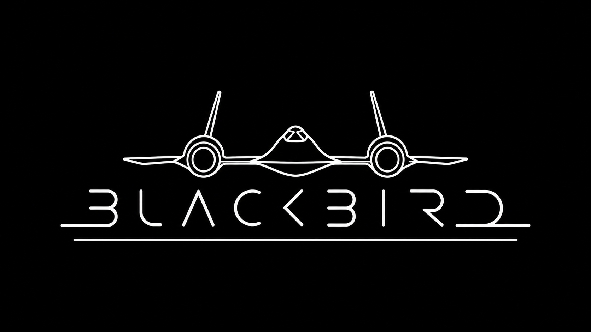

<p align="center">
  
</p>

# BlackBird Launcher — Releases & Distribution
### *Canal oficial de distribución de versiones compiladas (APK) y actualizaciones OTA para autorradios Android*

<p align="center">
  <a href="../../releases/latest">
    
  </a>
</p>

<p align="center">
  
  
  
  
  <a href="LICENSE">
    
  </a>
  <a href="PRIVACY.md">
    
  </a>
  <a href="https://github.com/RubyCrack/BL-launcher">
    
  </a>
</p>

---

## 📥 Descarga e Instalación

### Método 1: Actualización Automática OTA (Recomendado)
Si ya tienes instalada cualquier versión de **BlackBird Launcher**:
1. Conecta la autorradio a una red Wi-Fi o punto de acceso móvil.
2. Abre **Ajustes ➔ Sistema ➔ Actualización** en BlackBird Launcher.
3. Elige tu canal preferido:
   * **Estable:** Recibe exclusivamente versiones definitivas y consolidadas para el día a día.
   * **Beta:** Recibe versiones preliminares (*pre-releases*) con las últimas características antes de su despliegue general.
4. Pulsa **COMPROBAR**: la aplicación detectará automáticamente la versión más reciente en este repositorio, verificará su integridad criptográfica (SHA-256) y te guiará para instalarla directamente en pantalla.

> [!IMPORTANT]
> **Seguridad en Marcha:** Por normativa de seguridad HMI, las operaciones de actualización y confirmación de instalación requieren que el vehículo se encuentre completamente detenido.

---

### Método 2: Instalación Manual por APK
1. Descarga el paquete `app-release.apk` de la versión más reciente desde la sección [Releases](../../releases/latest).
2. Copia el archivo a una memoria USB (formateada en FAT32 o NTFS) o descárgalo directamente desde el navegador de la autorradio.
3. Conecta el USB a la pantalla, abre el explorador de archivos nativo y pulsa sobre el APK para instalarlo (habilita *«Instalar aplicaciones de fuentes desconocidas»* si el sistema lo solicita).
4. Pulsa el botón físico o táctil **HOME** de la consola y selecciona **BlackBird** como aplicación de inicio predeterminada (*«Siempre»*).

---

## 🚗 Matriz de Compatibilidad de Hardware

| Componente / Subsistema | Nivel de Compatibilidad | Especificaciones Técnicas |
| :--- | :---: | :--- |
| **Android Base** | **Nativo** | Compatible desde Android 9.0 (API 28) hasta Android 12.0. |
| **SoC Objetivo** | **Nativo** | Optimizado específicamente para procesadores MediaTek AC8257, Autochips y Jancar. |
| **Arquitecturas CPU** | **Nativo** | Compatible con ARM64 (`arm64-v8a`) y ARMv7 (`armeabi-v7a`). |
| **Resoluciones HMI** | **Nativo** | Formatos panorámicos de automoción (1024×600 y 1280×720) a 160 dpi. |
| **Radio FM/AM Física** | **Soportado** | Control directo del chip sintonizador de la placa base vía interfaz Binder IPC. |
| **Bluetooth OEM** | **Soportado** | Manos libres y streaming mediante el servicio de audio del fabricante. |
| **Bus CAN Nativo** | **Soportado** | Lectura pasiva de telemetría (odómetro, combustible), marcha atrás e iluminación. |
| **Posicionamiento GNSS** | **Nativo** | Fusión satelital continua con amortiguación de fluctuaciones y auto-recuperación de proveedores. |

> [!NOTE]
> **Aviso de Rendimiento y Plataforma de Validación:**
> BlackBird Launcher está calibrado, perfilado y probado exhaustivamente en bancos de pruebas reales con hardware **MediaTek AC8257 / Jancar en Android 9.0 (API 28)**. Aunque la aplicación es técnicamente compatible y puede instalarse en otros sistemas Android (hasta Android 12), **el rendimiento óptimo (60 FPS sostenidos, aguja continua, consumo mínimo de CPU/VRAM) y la integración directa de hardware (control del chip sintonizador por IPC, decodificación pasiva de bus CAN y sincronización LED de consola) solo pueden garantizarse en el hardware objetivo de referencia**. En autorradios con otros procesadores (como Allwinner, Rockchip o Unisoc) o ROMs personalizadas de otros fabricantes, el comportamiento, la compatibilidad con el bus CAN y la fluidez pueden variar significativamente.

---

## 🔒 Integridad Criptográfica (SHA-256)

El actualizador OTA comprueba automáticamente el hash criptográfico de cada archivo antes de ofrecer su instalación. Si descargas manualmente, puedes verificar el **SHA-256** del APK frente al publicado en las notas de la release:

* **En macOS / Linux:**
  ```bash
  shasum -a 256 app-release.apk
  ```
* **En Windows (PowerShell):**
  ```powershell
  Get-FileHash app-release.apk -Algorithm SHA256
  ```

---

## 📋 Registro de Versiones Reciente

### [v3.7.5 (Release Oficial)](../../releases/tag/v3.7.5)
* **Motor de Radares Headless:** Detección de cinemómetros continua en segundo plano unificada para todos los cuadros (Classic, Card y Performance), sin depender de Google Maps ni consumir memoria de vídeo.
* **Aguja Analógica a 60 FPS:** Interpolación cinemática fluida mediante animador finito, eliminando tirones entre tramas de señal GPS y CAN.
* **Actualizador OTA Integrado:** Comprobación, descarga reanudable con soporte HTTP Range, verificación SHA-256 y selector táctil de canales (**Estable** vs **Beta**).
* **Tipografía Inter y Estética CarPlay:** Estandarización de la tipografía **Inter** (Regular, Medium, Bold), esquinas redondeadas uniformes a 16dp y elevación de contraste diurno (`#CCFFFFFF`).
* **Nuevos Temas y Mapas Vectoriales:** Incorporación de **Sport Red** y **Cyber Purple** con perfiles JSON dedicados para Google Maps y blindaje de seguridad HMI en velocímetro.
* **Auto-Zoom Estabilizado:** Filtro paso bajo (EMA) e histéresis para eliminar fluctuaciones en la cámara de navegación.
* **Fluidez y Cero Jank:** Caché de paleta en memoria para `WifiAdapter` eliminando tirones en scroll y suite validada con 1.957 tests en verde.

### [v3.7.4 (Release Oficial)](../../releases/tag/v3.7.4)
* **Coordinador de Reanudación (`HomeResumeCoordinator`):** Sincronización atómica de perfiles al volver a primer plano y supresión síncrona en marcha atrás.
* **Telemetría de Velocidad:** Reconciliación de frescura al reanudar y distinción matemática entre 0 km/h y señal no disponible (`--`).
* **Privacidad Estricta en CAN y Bluetooth:** Anonimización de números de teléfono, contactos y exclusión de coordenadas GPS privadas en registros de diagnóstico.
* **Escuchador de Notificaciones:** Sistema de arrendamiento atómico (`NotificationListenerLease`) y filtrado ultrarrápido (<1 µs) de guiado (Maps/Waze).
* **Clima Resiliente:** Detección de saltos temporales del reloj (`ClockSanity`) y fusión inmutable CAN-Bus + API meteorológica.
* **Segundo Plano:** Suspensión de animaciones y liberación de recursos gráficos al pausar la interfaz.

---

## ⚖️ Marco Legal, Privacidad y Seguridad Vial

Esta distribución incluye la licencia, la información de privacidad y los avisos siguientes:

| Documento | Descripción |
| :--- | :--- |
| **[TERMS.md](TERMS.md)** | **Aviso de Uso y Seguridad Vial:** Reglas de atención al volante, límites de velocidad y radares, y condiciones de la licencia GPLv3 en la medida permitida por la ley. |
| **[PRIVACY.md](PRIVACY.md)** | **Información de Privacidad:** Almacenamiento local, permisos, diagnósticos y consultas a Open-Meteo, Overpass, Google Maps y GitHub. |
| **[LICENSE](LICENSE)** | **Licencia de Software:** Distribuido bajo la licencia [GNU General Public License v3.0 (GPLv3)](LICENSE). |
| **[ATTRIBUTIONS.md](ATTRIBUTIONS.md)** | **Atribuciones de Terceros:** Licencia de Bases de Datos Abiertas (ODbL) de © OpenStreetMap, datos de Open-Meteo, tipografía Inter (SIL OFL 1.1) de Rasmus Andersson, alias de compatibilidad Montserrat y librerías de código abierto. |
| **[SECURITY.md](SECURITY.md)** | **Política de Seguridad:** Procedimiento para el reporte responsable de incidencias de seguridad a través de GitHub Security Advisories. |

---

<p align="center">
  <sub>BlackBird Launcher — Desarrollado por <a href="https://github.com/RubyCrack">RubyCrack</a> bajo licencia <a href="LICENSE">GPLv3</a>.<br>Código fuente completo disponible en <a href="https://github.com/RubyCrack/BL-launcher">RubyCrack/BL-launcher</a>.</sub>
</p>
